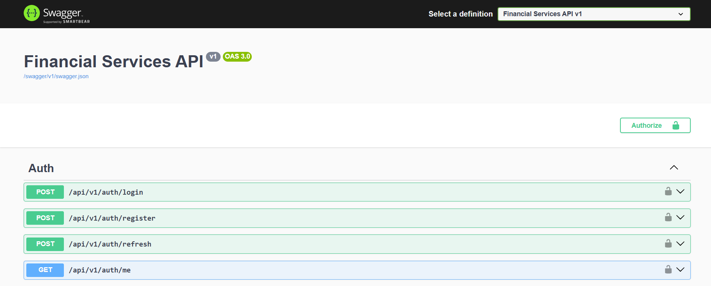
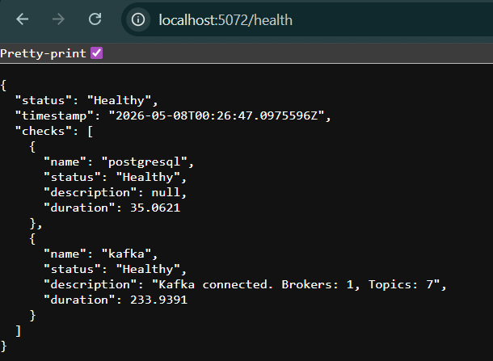
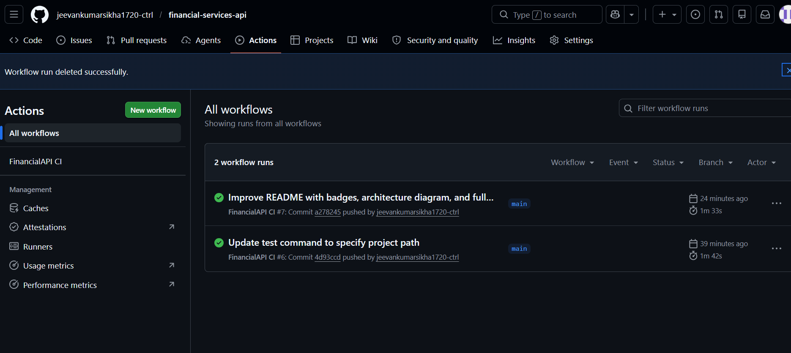

# 💳 Financial Services API

<div align="center">

[](https://github.com/jeevankumarsikha1720-ctrl/financial-services-api/actions/workflows/ci.yml)


**A production-grade Financial Services REST API built with Clean Architecture, event-driven messaging, JWT authentication, and automated CI/CD.**

[Features](#-features) • [Tech Stack](#-tech-stack) • [Architecture](#-architecture) • [Getting Started](#-getting-started) • [API Endpoints](#-api-endpoints) • [Screenshots](#-screenshots) • [Running Tests](#-running-tests)

</div>

---

## ✨ Features

| Module | Description |
|---|---|
| 💳 **Payment Processing** | Initiate, track, and settle payments with full state machine (Pending → Processing → Settled / Failed / OnHold) |
| 🏦 **Financial Settlement** | Batch payments into settlement runs with net position calculation and reconciliation |
| 👥 **Beneficiary Management** | Add, verify, and manage payment recipients with IBAN/SWIFT validation and compliance workflow |
| 📒 **Transaction Ledger** | Double-entry bookkeeping — every payment generates a matching Debit + Credit pair with full balance history |
| 🚨 **Fraud Detection** | Risk-scored alerts, auto-block at ≥0.8, compliance officer review workflow |
| 🔔 **Notifications** | Event-driven in-app notifications triggered automatically by Kafka events across all modules |
| 🔐 **JWT Authentication** | Bearer token auth with refresh tokens and three roles: Admin, ComplianceOfficer, User |

---

## 🛠 Tech Stack

| Category | Technology |
|---|---|
| **Framework** | ASP.NET Core 10 Web API |
| **Language** | C# 12 |
| **Database** | PostgreSQL 16 |
| **ORM** | Entity Framework Core 9 |
| **Message Broker** | Apache Kafka (Confluent) |
| **Auth** | JWT Bearer + BCrypt password hashing |
| **Validation** | FluentValidation |
| **Logging** | Serilog (Console + File, structured JSON) |
| **API Docs** | Swagger / OpenAPI with JWT Authorize button |
| **Testing** | xUnit + Moq + FluentAssertions |
| **Containers** | Docker + Docker Compose (7 services) |
| **CI/CD** | GitHub Actions |

---

## 🏗 Architecture

This project follows **Clean Architecture** — each layer has one responsibility and depends only on layers below it:

```
FinancialAPI/
├── src/
│   ├── FinancialAPI.Domain          ← Entities, Enums, Domain Events (zero dependencies)
│   ├── FinancialAPI.Application     ← DTOs, Interfaces, Services (business logic only)
│   ├── FinancialAPI.Infrastructure  ← EF Core, Kafka, Repositories (all I/O)
│   ├── FinancialAPI.API             ← Controllers, Middleware, Program.cs (HTTP layer)
│   └── FinancialAPI.Shared          ← KafkaSettings, JwtSettings (shared config)
├── tests/
│   ├── FinancialAPI.UnitTests       ← xUnit + Moq (14 tests, 0 failures)
│   └── FinancialAPI.IntegrationTests
├── docker-compose.yml
└── README.md
```

### Event Flow

```
HTTP Request → Controller → Service → Domain Entity → DB Save
                                    ↓
                              Kafka Producer → Topic → Consumer → Notification
```

---

## 🚀 Getting Started

### Prerequisites

- [.NET 10 SDK](https://dotnet.microsoft.com/download)
- [Docker Desktop](https://www.docker.com/products/docker-desktop)
- [Git](https://git-scm.com/)

### 1. Clone the repository

```bash
git clone https://github.com/jeevankumarsikha1720-ctrl/financial-services-api.git
cd financial-services-api
```

### 2. Start infrastructure (PostgreSQL + Kafka + Kafdrop + pgAdmin)

```bash
docker compose up -d
```

This starts 7 containers:

| Service | URL | Description |
|---|---|---|
| PostgreSQL | `localhost:5432` | Primary database |
| pgAdmin | http://localhost:8080 | DB browser (admin@financial.com / Admin@123) |
| Kafka | `localhost:9092` | Message broker |
| Kafdrop | http://localhost:9000 | Kafka topic browser |
| Zookeeper | `localhost:2181` | Kafka coordination |

### 3. Run the API

```bash
dotnet run --project src/FinancialAPI.API
```

The API will automatically apply EF Core migrations on first run in Development mode.

### 4. Open Swagger

```
http://localhost:5000/swagger
```

### 5. Login and get a token

**POST** `http://localhost:5000/api/v1/auth/login`

```json
{
  "username": "admin",
  "password": "Admin@123"
}
```

Built-in accounts:

| Username | Password | Role |
|---|---|---|
| `admin` | `Admin@123` | Admin |
| `compliance` | `Compliance@123` | ComplianceOfficer |
| `jeevan` | `Jeevan@123` | User |

Click the **Authorize** button in Swagger, paste the `accessToken` — all 40+ endpoints unlock immediately.

### Health Check

```
http://localhost:5000/health
```

---

## 📡 API Endpoints

| Controller | Endpoints | Description |
|---|---|---|
| `/api/v1/auth` | 4 | Login, Register, Refresh token, Me |
| `/api/v1/payments` | 9 | Full payment lifecycle |
| `/api/v1/settlements` | 8 | Batch settlement processing |
| `/api/v1/beneficiaries` | 10 | Beneficiary management & compliance |
| `/api/v1/ledger` | 5 | Double-entry ledger + balance |
| `/api/v1/fraud` | 5 | Fraud alert raise & review |
| `/api/v1/notifications` | 5 | In-app notification inbox |
| **Total** | **46** | |

---

## 🧪 Running Tests

```bash
dotnet test
```

```
Test summary: total: 14, failed: 0, succeeded: 14, skipped: 0
```

Test coverage:

| Suite | Tests | What's covered |
|---|---|---|
| `PaymentServiceTests` | 3 | Happy path, missing beneficiary, unknown ID |
| `FraudServiceTests` | 3 | High risk alert, low risk rejection, missing alert |
| `AuthServiceTests` | 3 | Valid login, wrong password, wrong username |
| `AuthEndpointsTests` | 5 | Integration tests for auth endpoints |

---

## 🐳 Docker Services

```bash
# Start all services
docker compose up -d

# Stop all services
docker compose down

# View logs
docker compose logs -f financial-api

# Reset everything (including volumes)
docker compose down -v
```

---

## 🔑 Key Design Patterns

- **Repository + Unit of Work** — generic `Repository<T>` with `GetPagedAsync`, all repos share one `DbContext` for atomic commits
- **Domain Events** — entities collect events internally, dispatched after `SaveChangesAsync`
- **Kafka At-Least-Once** — manual offset commit, dead-letter logging on handler failure
- **Soft Delete** — no record is ever hard-deleted; global EF query filter hides deleted rows
- **Payment State Machine** — invalid transitions throw exceptions at the domain entity level
- **Double-Entry Bookkeeping** — every financial movement creates a Debit + Credit pair
- **Scoped DI in Singleton** — Kafka background services use `IServiceScopeFactory` to resolve scoped `DbContext` safely

---

## 📸 Screenshots

| Swagger UI | Health Check | GitHub Actions CI |
|---|---|---|
|  |  |  |

---

## 📁 Project Stats

- **93** source files
- **46** REST API endpoints  
- **7** domain modules
- **7** EF Core entity configurations
- **4** Kafka background consumers
- **14** unit + integration tests — all passing
- **1** GitHub Actions CI pipelin